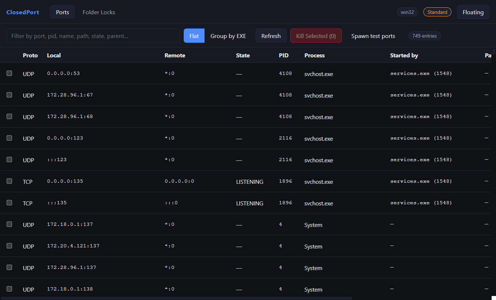
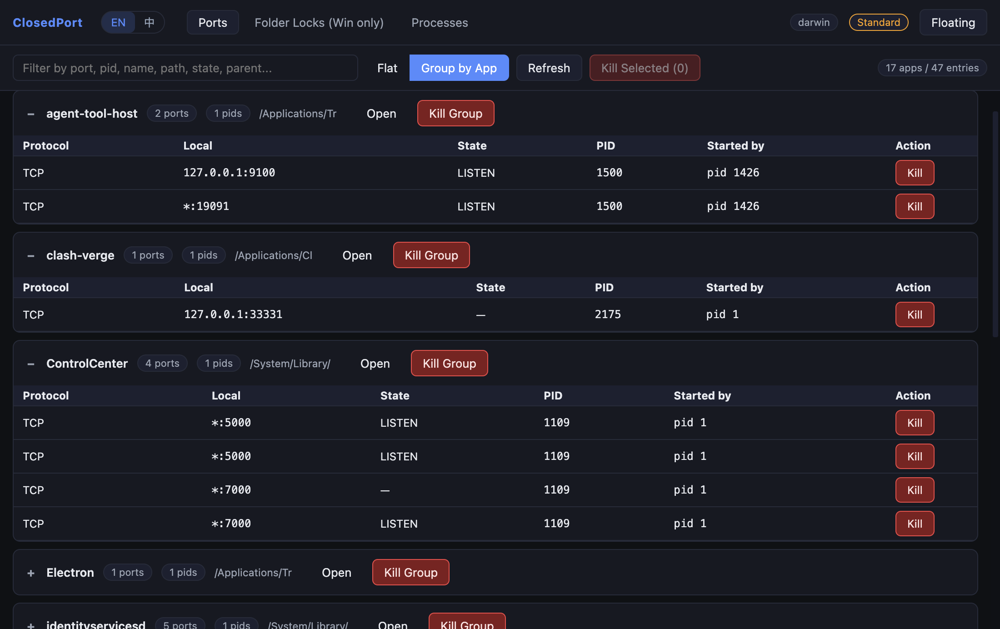
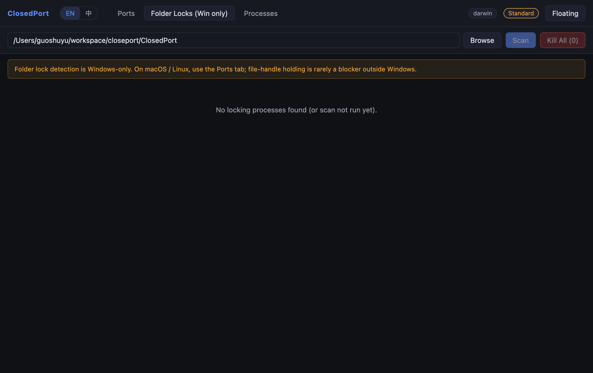

# ClosedPort

<p align="center">
  
</p>

> Cross-platform desktop tool to inspect and reclaim listening ports & file locks, with one-click kill, an always-on-top floating panel, and per-EXE grouping.

跨平台桌面小工具：列出系统所有占用的端口与对应进程、查看 Windows 文件夹中谁在占用文件、一键 kill 释放，附带常驻悬浮窗与按 EXE 归类视图。Windows / macOS / Linux 三端通吃。

---

## 截图 / Screenshots

> 下面这几张图是 ClosedPort 在 Windows 上的真实运行截图（真实 `listPorts()` 数据，未做任何 mock 或 PS）。源文件在 [docs/screenshots/](docs/screenshots)，由维护者偶尔手动重生成（具体方法见本文最后的"截图回归 Screenshot regen"小节）。普通用户**无需关心**这套机制，应用启动时不会自动截图。

主窗口 · 平铺视图（Flat），右侧 `Started by` 列显示每个进程的父级：



主窗口 · 按 EXE 归类视图（Group by EXE），同一进程占用的多个端口聚合在一起，可整组 Kill：



文件夹占用扫描（Windows 专属）。截图中的机器没有放置 `handle.exe`，UI 顶部明确给出降级提示与解决办法；放入 `handle.exe` 后即可扫到内核态句柄：



悬浮迷你面板（Always-on-top），子行显示 `by <parent>`：


---

## 功能 Features

- **端口占用一览**：列出全部 TCP / UDP / TCP6 / UDP6 监听与连接，附带 PID、进程名、可执行文件路径、用户、命令行。
- **启动者 / 父进程**：每条记录都能看到父进程名 + PPID，方便定位"这个端口到底是哪个程序拉起来的子进程占住的"。
- **按 EXE 归类视图**：当一个进程占用多个端口时，把它们折叠在一起，整组一键 Kill。视图顶部支持按 **Name / Ports / PIDs** 升降序切换（默认按 Name 字母升序，`Unknown` 桶始终置底）。Flat 视图默认按 Local Port 升序。
- **Tab 状态保留**：Ports / Folder Locks 两个 Tab 共享生命周期，切换不会清空过滤、排序、展开的分组、已扫描的结果。
- **System Idle / System (kernel) 桶**：Windows 上 PID 0（TIME_WAIT 占位）和 PID 4（NT 内核 / 驱动 listen）会单独命名归类，不会再混在 "Unknown" 里。
- **文件夹占用扫描（Windows 专属）**：定位是哪个进程锁住了你工作目录里的文件。优先调用 Sysinternals `handle.exe`（覆盖内核态句柄），缺失时自动回退到 Windows Restart Manager API（覆盖大部分用户态锁，例如编辑器、办公软件、IDE）。
- **一键 Kill**：单条 / 多选 / 整组三种粒度。Windows 使用 `taskkill /F /T` 顺带终止子进程；macOS/Linux 使用 `SIGKILL`。
- **悬浮迷你面板**：常驻置顶窗口，在所有桌面（虚拟桌面 / Spaces）可见，可暂停自动刷新。
- **托盘集成**：单实例锁、托盘菜单切换主窗口 / 悬浮窗 / 退出。托盘使用 `build/tray.png`。
- **零原生依赖**：纯 Node + 平台原生命令行工具，无 native 模块编译需求。
- **诊断 / 测试按钮（Windows）**：工具栏一个橙色虚线 **Spawn test ports** 按钮，点一下 fork 5 个绑随机端口的子进程，并把它们以橙色高亮 + `TEST` 徽章浮在列表顶部，便于端到端验证 Kill 流程。这些子进程**不会自动清理**，需要你手动用 Kill / Kill Group 释放。Linux / macOS 不显示。

---

## 快速开始 Quick start

```bash
# 1. 安装依赖
npm install

# 2. 一键构建并启动
npm start
```

启动后默认显示主窗口。点工具栏右上角 **Floating** 可弹出悬浮迷你面板，再点一次会隐藏。也可以从托盘菜单切换。

### 开发模式（热更新）

```bash
# 终端 1
npm run dev                              # 启动 vite dev server :5173

# 终端 2 (PowerShell)
$env:CLOSEDPORT_DEV_SERVER = "1"
npm run build:main
npx electron .

# 终端 2 (bash / zsh)
export CLOSEDPORT_DEV_SERVER=1
npm run build:main
npx electron .
```

开发模式下，Windows 主窗口会显示一个橙色虚线 **Spawn test ports** 按钮，用于快速创建若干临时占用端口的子进程，方便端到端验证 Kill 流程。点击后，会 spawn 5 个 ELECTRON_RUN_AS_NODE 模式的子进程（PPID 指向当前 ClosedPort），每个 bind 一个随机 TCP 端口；它们会以橙色高亮 + `TEST` 徽章浮在 Flat 列表顶部，**不会自动清理**，需要你点行尾 Kill 或在 Group by EXE 视图下用 Kill Group 主动释放。**注意**：当前为了便于测试，packaged 安装包里这个按钮也保留可用；后续若需要彻底隐藏，把 [src/main/index.ts](src/main/index.ts) 中 `devToolsEnabled` 的判断改成 `os.platform() === 'win32' && !app.isPackaged` 即可。

---

## 打包 Packaging

```bash
npm run dist:win     # Windows: NSIS 安装包 + 便携版
npm run dist:mac     # macOS:   dmg + zip
npm run dist:linux   # Linux:   AppImage + deb
```

打包前如果想让 Windows 文件夹扫描更全面，把 [handle.exe / handle64.exe](https://learn.microsoft.com/en-us/sysinternals/downloads/handle) 拷贝到仓库根目录的 `resources/` 下。`.gitignore` 已经把它们忽略了，不会污染版本库，但 electron-builder 会把这个目录打进发布包。

> macOS 产物**未签名 / 未公证**：双击 dmg / zip 解压后的 `.app` 首次运行会被 Gatekeeper 拦下，需要在「系统设置 → 隐私与安全」里手动放行；或者你 fork 后自行配置 `CSC_LINK` / `CSC_KEY_PASSWORD` / `APPLE_ID` / `APPLE_APP_SPECIFIC_PASSWORD` / `APPLE_TEAM_ID` 这几个 secrets，让 electron-builder 在 CI 里自动签名+公证。Windows 产物同样未签名，下载后 SmartScreen 可能提示「未知发布者」，可在文件属性里勾「解除锁定」。

CI 已配置在 push tag (`v*`) 时为三平台构建产物并发布到 GitHub Releases，详见 [.github/workflows/release.yml](.github/workflows/release.yml)。本地手动发布版本：

```bash
git tag v0.1.0
git push origin v0.1.0
```

---

## 测试 Testing

工具自带两套测试：

```bash
# E2E：Node 直接跑 backend 模块（不依赖 Electron 启动 GUI）
npm run test:e2e
# 检查项：
#   - 当前进程 PID 反查名称 / 路径
#   - 自己开 listener，端口能在结果里被找到，含 processName + parentPid
#   - 起一个子进程绑端口，killer 杀完端口被释放
#   - 非法 PID 走错误分支不抛
#   - 文件夹扫描调用不抛

# Smoke：spawn 真实 Electron 二进制，主进程内跑一次 listPorts
npm run test:smoke
```

测试用例固定无网络依赖，CI 友好。CI 在 [.github/workflows/ci.yml](.github/workflows/ci.yml) 里跑三平台 build + e2e；smoke 因为要 spawn 真实 Electron 二进制（Linux runner 还得 xvfb），暂未进 CI，仅供本地与发布前手动验证。

### 截图回归 Screenshot regen（维护者使用，普通用户跳过）

> ⚠️ **这是仓库维护者用来重新生成 [docs/screenshots/](docs/screenshots) 那几张图的开发者 hook，不是产品功能。**普通用户、贡献者、CI 环境**不要**设置 `CLOSEDPORT_SCREENSHOT_DIR`，否则启动 ClosedPort 时它会进入截图模式：自动驱动 UI 跑一遍 → 写 PNG → **`app.quit()` 直接退出**。

主进程在 [src/main/index.ts](src/main/index.ts) 中 `if (process.env.CLOSEDPORT_SCREENSHOT_DIR)` 这一段会启用这个分支。维护者重生截图：

```powershell
# Windows / PowerShell —— 用完务必清除该环境变量，否则下一次启动会再次自动退出
$env:CLOSEDPORT_SMOKE = $null
$env:CLOSEDPORT_SCREENSHOT_DIR = "$PWD\docs\screenshots"
npm run build; npx electron .
# 跑完后立刻：
$env:CLOSEDPORT_SCREENSHOT_DIR = $null
```

它会依次切到 Flat / Group by EXE / Folder Locks / Floating 四个 UI 状态，每个状态调用一次 `BrowserWindow.capturePage()` 写 PNG，然后退出。

---

## 平台后端实现 Backends per platform

| 能力              | Windows                                                  | macOS               | Linux                                |
| ----------------- | -------------------------------------------------------- | ------------------- | ------------------------------------ |
| 端口列表          | `netstat -ano -p TCP/UDP/TCPv6/UDPv6`                    | `lsof -nP -i -F`    | `lsof` → 缺则 `ss -tunlpH`           |
| 进程基本信息      | `tasklist /FO CSV /NH`                                   | `ps -p ... -o ...`  | `ps -p ... -o ...`                   |
| 进程路径 / 父进程 | **单次** `Get-CimInstance Win32_Process`（PowerShell）   | 同 ps               | `/proc/<pid>/exe` + `/proc/<pid>/cmdline` |
| 文件夹占用        | `handle.exe` → Restart Manager API                       | n/a                 | n/a                                  |
| 进程终止          | `taskkill /F /T`                                         | `SIGKILL`           | `SIGKILL`                            |

> Windows 端故意没用 `tasklist /V`：在某些环境下会因为 SeDebugPrivilege 的细节导致输出在前几行被截断并 hang 数秒。详见 [src/main/utils/processInfo.ts](src/main/utils/processInfo.ts) 顶部注释。

---

## FAQ

### Q：会让 WMI Provider Host (`WmiPrvSE.exe`) 占很高 CPU 吗？

**不会**。早期开发版本曾经用 `wmic` 做进程信息查询，在端口很多时会引起 WmiPrvSE CPU 飙高。当前实现是**单次** `Get-CimInstance Win32_Process -Filter "ProcessId=A OR ProcessId=B OR ..."`，N 个 PID 只发起一次 WMI 查询。

### Q：怎么看一个进程是被谁启动的？

端口表里的 **Started by** 列就是父进程（显示为 `parentName (PPID)`）。同样的字段也透传到悬浮窗与按 EXE 归类视图。要看完整祖先链可以使用过滤框输入父 PID 反向查找上一级。

### Q：点 Kill 没反应 / 杀不掉？

绝大多数情况是权限不足：

- Windows：杀系统进程需要管理员，启动 ClosedPort 时右键 "以管理员身份运行"。
- macOS / Linux：杀 root 进程需要 sudo，请用 `sudo` 启动应用。

系统关键进程（System / smss / csrss / wininit 等）即使有权限也**强烈不建议**手动杀，会导致系统不稳定甚至蓝屏。

### Q：没有 `handle.exe` 也能扫文件夹吗？

能。会自动回退到 Windows Restart Manager API（PowerShell 内联调用）。Restart Manager 覆盖 IDE / Office / 大部分用户态程序，但**不**覆盖驱动级或内核句柄。需要全覆盖请将 `handle.exe` / `handle64.exe` 放入 `resources/` 目录。

### Q：macOS / Linux 上文件夹占用 Tab 一直空？

这是预期行为。Unix 文件系统没有"文件夹被锁"这种语义（删除目录中被打开的文件不会失败，会延迟回收），所以这个功能是 Windows 专属。要查谁打开了某个具体文件，用 `lsof <path>` 即可。

### Q：悬浮窗在某些虚拟桌面看不到？

确保系统没禁用"跨桌面置顶"。代码里调用了 `setAlwaysOnTop(true, 'floating')` + `setVisibleOnAllWorkspaces(true, { visibleOnFullScreen: true })` + `skipTaskbar`。

### Q：为什么有些行进程名是 "System Idle / TIME_WAIT" 或 "System (Windows kernel)"？

Windows 的 `netstat -ano` 会出现两个特殊 PID：

- **PID 0** — System Idle Process。当一个连接处于 TIME_WAIT 等过渡状态、内核占位但没归属用户态进程时，`netstat` 把它写成 0。我们直接命名为 `System Idle / TIME_WAIT`。
- **PID 4** — NT 内核（System / ntoskrnl.exe）。SMB、HTTP.sys（IIS / WinRM）、驱动级 listener 全部挂在这个 PID 下。我们命名为 `System (Windows kernel)`，路径填 `C:\Windows\System32\ntoskrnl.exe`。

这两类**杀不掉也不应该尝试杀**。如果你看到一大堆 `System (Windows kernel)` 的 80 / 443 / 5985，说明 IIS / WinRM / HTTP.sys 注册了端口预留，要解除请用 `netsh http delete urlacl` 或停对应的服务。

### Q：Spawn test ports 点了没反应？

修复后 [src/main/devTools.ts](src/main/devTools.ts) 必须把 entry.js 路径作为 `argv[1]` 传进 `spawn`，否则 `ELECTRON_RUN_AS_NODE=1` 模式下 Electron 会进入 Node REPL，永远不会执行 fake-port-holder 分支。如果你魔改了 devTools.ts 又踩到 "No test ports were spawned"，先检查这个。

---

## 项目结构 Project layout

```
src/
  main/                 Electron 主进程
    index.ts            应用启动 / 窗口 / 托盘 / IPC / 默认菜单移除
    entry.ts            程序入口；CLOSEDPORT_FAKE_PORT_HOLDER=1 时切到 fake-holder 分支
    portScanner.ts      端口扫描（netstat / lsof / ss），PID 0/4 命名归类
    folderScanner.ts    文件夹句柄扫描（Windows）
    killer.ts           跨平台进程终止
    devTools.ts         "Spawn test ports" 诊断（Windows，dev 与 packaged 都启用；非 win32 隐藏）
    utils/
      exec.ts           child_process exec / execFile 封装 + 超时（folderScanner 用 execFile 避免命令注入）
      processInfo.ts    进程详情批量预热（单次 PowerShell / Get-CimInstance）
  preload/
    index.ts            contextBridge 暴露 API
  renderer/             Vite + React UI
    index.html          主窗口入口
    floating.html       悬浮窗入口
    src/                React 组件 + 样式（Tab display:none 持久化、TEST 高亮、Group 排序条）
  shared/
    types.ts            PortEntry / FolderHandleEntry / SystemInfo / ApiSurface
    ipc.ts              IPC 通道常量

build/                  app icon 资产（由 scripts/make-icons.ps1 生成）
  icon.ico              Windows multi-size（16/24/32/48/64/128/256）
  icon.png              512x512，macOS / Linux / 运行时 BrowserWindow icon
  tray.png              32x32 托盘图标
  icons/                单尺寸 PNG（Linux .deb / AppImage）

scripts/
  make-icons.ps1        从任意 PNG 生成 build/icon.ico + 所有尺寸 PNG；用 `-Source <path>` 指定源图（默认 assets/logo.png 不在仓库里，直接跑会报 "Source not found"）

tests/
  e2e.js                Backend E2E（不启动 GUI）
  smoke.js              真 Electron 启动 + IPC 路径冒烟

resources/              可选的 handle.exe / handle64.exe

.github/workflows/
  ci.yml                push / PR 时跑三平台 build + e2e
  release.yml           push tag v* 时三平台打包并发布 Release
```

---

## 贡献 Contributing

欢迎 issue 与 PR。提交前请保证：

```bash
npm run test:e2e       # 必须通过
npm run build          # tsc + vite build 全绿
```

代码风格：TypeScript strict，无 emoji，UI 文案以英文为主、必要处补充中文。

---

## License

MIT — see [LICENSE](LICENSE).

---

## 鸣谢 Credits

- Sysinternals `handle.exe` — Mark Russinovich
- Electron / React / Vite 社区
